# Değişiklik Yaşam Döngüsü Sözleşmesi

**Durum:** 7 Ekim 2026 tarihli uygulama sözleşmesi önerisi; danışman ve uygulama incelemesine açık.
**Kanıt düzeyi:** Belgelendi; uygulanmadı ve çalışma zamanı testleriyle doğrulanmadı.

Bu belge [SYSTEM_PLAN](../SYSTEM_PLAN.md) §9–10, [güvenlik katmanları](../SAFETY_AND_GUARDRAILS.md)
§2 ve [UC-02](../diagrams/UC/UC-02-kod-degisikligi-yasam-dongusu.puml) akışındaki onay,
çok dosya uygulama, kesinti ve geri alma boşluklarını kapatır. Mevcut kabul edilmiş kararları değiştirmez:
[ADR-006](adr/ADR-006-no-shell-execution-in-mvp.md) uyarınca ajan shell, test komutu veya keyfî süreç
çalıştıramaz; [ADR-004](adr/ADR-004-manual-model-selection.md) uyarınca sağlayıcı seçimi kullanıcıya aittir.

**Şema uzantısı bekliyor:** Aşağıdaki transaction, approval ve verification alanlarının tamamı mevcut
[plan](schemas/plan.schema.json) ve [audit](schemas/audit-event.schema.json) şemalarında tanımlı değildir.
Bu belge tek başına şemayı değiştirmez. Uygulamaya geçmeden önce ilgili kartta sürümlü şema, geçiş
kuralları ve uyumlu örnekler hazırlanmalıdır. Mevcut şema `additionalProperties: false` olduğundan yeni
alanlar top-level'a sessizce eklenemez. Geçici evidence metadata kullanımı da açık bir sözleşmeyle doğrulanmalıdır.

## 1. Yetki ve bileşen sınırı

| Bileşen | Yetkisi | Güvenlik kararı |
|---|---|---|
| Monaco / chat renderer | Dosya ve diff görüntüleme; kullanıcı kararı iletme | Doğrudan dosya sistemi, API anahtarı, genel IPC veya shell erişimi yok |
| Preload köprüsü | İsimleri sabit ve girdileri doğrulanan sınırlı çağrılar | Renderer'a genel `ipcRenderer.send/invoke`, `fs` veya keyfî kanal açmaz |
| Main-process broker | Workspace, dosya politikası, staged patch, approval, transaction ve audit yönetimi | Yazma yetkisi burada; model ve renderer girdisi güvenilir kabul edilmez |
| Ajan / sağlayıcı adaptörü | Okuma ve retrieval talebi; değişiklik önerisi | Dosyayı doğrudan değiştiremez; model çıktısı veri ve öneridir |
| Verifier rolü varsa | Requirement + diff üzerinden bulgu/evidence üretme | Yazma veya insan onayı yerine geçme yetkisi yok; ayrı runtime MVP kararı değildir |

Uygulama önerisi: renderer için `nodeIntegration: false`, `contextIsolation: true`, renderer process
sandboxing, kısıtlı CSP ve IPC sender doğrulaması ilk shell diliminde kontrol edilir. Electron renderer
sandboxing, projenin workspace boundary mekanizmasını OS sandbox olarak adlandırma hakkı vermez.
Bu önerilerin dayanağı [Electron güvenlik rehberidir](https://www.electronjs.org/docs/latest/tutorial/security).

`write_file` model açısından **değişiklik önerisi/staging** yapar. Gerçek apply, broker'ın kullanıcı
kararından sonra yürüttüğü ayrı işlemdir. “Executor”, onaydan önce gerçek dosya yazan ajan olarak yorumlanamaz.
Korumalı dosya ve workspace kuralları prompt talimatlarına değil, broker'ın deterministik kontrollerine dayanır.

## 2. Değişmeyen kurallar

1. Onay, tam olarak gösterilen patch'e ve dosyaların gösterim anındaki başlangıç içeriğine bağlıdır.
2. Model yeni patch üretirse, kullanıcı seçim değiştirirse veya bir başlangıç dosyası değişirse eski onay geçersizdir.
3. Protected-file, workspace ve secret-in-diff blokları kullanıcı onayıyla kaldırılamaz.
4. Okuma, indeksleme, pinned/aktif dosya ve prompt oluşturma yolları aynı zorunlu gizlilik politikasını kullanır.
5. Aynı workspace için uygulama içinde tek aktif write transaction bulunur. Dış editör değişiklikleri ayrıca algılanır.
6. İşlem yarım kaldıysa sistem “uygulandı” diyemez; recovery tamamlanana kadar yeni ajan yazması durur.
7. İnsan onayı kodun işlevsel doğruluğunun kanıtı değildir; safety pass de derleme/test başarısı değildir.
8. Ajanın araç yüzeyi shell, `exec`, `eval`, package install veya otomatik test çalıştırma içermez.

## 3. Durum modeli

```mermaid
stateDiagram-v2
    [*] --> Proposed
    Proposed --> Validated: plan ve staged diff geçerli
    Proposed --> Blocked: politika veya format ihlali
    Validated --> AwaitingApproval: diff ve riskler gösterildi
    AwaitingApproval --> Approved: insan patch sürümünü onayladı
    AwaitingApproval --> Cancelled: ret veya iptal
    AwaitingApproval --> Proposed: revizyon / dosya seçimi değişti
    Approved --> Stale: base veya politika değişti
    Stale --> Proposed: yeniden plan ve yeni onay
    Approved --> Applying: preflight ve journal hazır
    Applying --> Committed: tüm seçili dosyalar ve commit kaydı tamam
    Applying --> Recovering: hata / kesinti / belirsiz durum
    Recovering --> Restored: transaction öncesi durum doğrulandı
    Recovering --> RecoveryRequired: harici değişiklik veya restore hatası
    Committed --> RolledBack: kullanıcı geri aldı; hashler uygun
    Committed --> RollbackConflict: commit sonrası dosya değişmiş
```

`Blocked`, `Cancelled`, `Stale`, `Restored`, `RecoveryRequired`, `RollbackConflict` sonuçlarının hiçbiri
başarılı uygulama sayılmaz. `RecoveryRequired` durumunda otomatik retry yoktur; dosya başına durum,
sanitize edilmiş hata ve kurtarma seçenekleri gösterilir. Yeni bir agent run, tamamlanmamış eski transaction'ı devralamaz.

## 4. Plan, patch ve onay kaydı

Uygulama sırasında gereken öneri alanları:

| Kayıt | Asgari bilgi |
|---|---|
| Run | `runId`, `taskId` varsa, condition, workspace kimliği, başlangıç zamanı, seçili provider/model ve sürümler |
| Plan | `planId`, `planRevision`, goal, requirement referansları, affectedFiles, risk, policy sürümleri |
| Patch set | `patchSetId`, plan revision, normalize edilmiş relatif yollar, operation, `baseHash`, `proposedHash`, diff fingerprint |
| Approval | `approvalId`, patch fingerprint, seçili dosyalar, karar, insan karar zamanı, workspace kimliği |
| Transaction | `transactionId`, patch/approval referansları, dosya başına durum, backup/journal referansı, sonuç |
| Evidence | Requirement/acceptance criterion referansı, evidence türü, üretici, ilgili patch/tree fingerprint, zaman ve verdict |

Hashler ekranda satır sonu normalize edilmiş metinden değil, okunup yazılacak kesin baytlardan hesaplanır.
Başlangıç dosyası olmayan create için `baseHash` yerine açık `absent` durumu kullanılır. Path ve içerik
eşleşmeleri hash dışında kontrol edilir; hash bir yetkilendirme mekanizması değildir.

MVP ilk dilimi `modify` üzerinde başlar. `create` ikinci kontrollü dilim olarak eklenebilir; oluşturma
anında hedefin hâlâ bulunmadığı doğrulanır ve rollback yalnızca bu işlem tarafından oluşturulan dosyayı kaldırır.
Mevcut plan şemasında `delete` enum bulunması delete/rename aracının uygulanmış olduğunu göstermez. Delete,
rename, binary dosya, link oluşturma ve otomatik dizin temizleme ayrı acceptance criteria hazırlanmadıkça reddedilir.

Kayıtlı dosyayla dirty Monaco buffer farklıysa sessiz overwrite yapılmaz. Kullanıcı önce kaydeder veya
değişikliği bırakır; ardından snapshot ve diff yeniden üretilir. Apply tamamlandığında UI buffer sürümü de
kontrol edilerek güncellenir; bu sırada oluşmuş yeni kullanıcı düzenlemesi ezilemez.

## 5. Seçerek uygulama

`Apply Selected`, rastgele bazı dosyaları yazmak değildir. Seçim yeni bir patch kapsamı oluşturur:

1. Kullanıcı kapsamı seçer; broker bağlı adımları ve eksik bağımlılıkları gösterir.
2. Safety ve varsa verifier sadece seçili nihai patch üzerinde yeniden çalışır.
3. Yeni fingerprint ile nihai diff tekrar onaya sunulur. Önceki “tüm plan” onayı kullanılamaz.
4. Uygulanan ve reddedilen dosyalar ayrı raporlanır. Kalan dosyalar otomatik uygulanmaz.

İlk çalışan dilimde bağlı çok dosyalı refactor için yalnızca “Tümünü Uygula / İptal” sunmak önerilir.
Bağımlılık kontrolü hazır olduğunda seçerek uygulama eklenir. Bu bir kapsam önerisidir; mevcut UC-02'deki
seçerek uygulama gereksinimini kendiliğinden kaldırmaz. Danışman/backlog kararında sonucu kaydedilmelidir.

## 6. Preflight, uygulama ve kesinti kurtarma

Tek dosyalık temp-write + rename, tüm dosya setine aynı anda işletim sistemi atomikliği sağlamaz.
Buradaki hedef **uygulama düzeyinde transaction ve doğrulanabilir kurtarma**dır. Başka süreçler yazma
arasında geçici kısmi dosya durumları görebilir; bu sınır tezde açıkça yazılır.

Önerilen protokol:

1. Broker workspace write kilidini alır; approval'ın hâlâ bu patch'e ait olduğunu doğrular.
2. Her hedef için canonical kök/ebeveyn, path segment containment, link/junction, protected-file,
   erişim, UTF-8/binary politikası, base hash ve dirty-buffer kontrolü yapılır.
3. Exact başlangıç baytları ve create için absent durumu korumalı transaction deposuna kaydedilir.
   Undo backup, staged dosya ve journal indeksleme/model context dışında tutulur; rastgele unique adlar kullanılır.
4. Tüm yeni içerikler hedefle aynı dosya sistemindeki geçici dosyalara stage edilir. Hedef dosya ve
   temp dosya izinleri korunur; staging başarısızsa gerçek dosya yazması başlamaz.
5. Yazma niyeti ve transaction manifesti kalıcılaştırılır. Audit veya recovery kaydı üretilemiyorsa apply başlamaz.
6. Her hedef yazılmadan hemen önce base hash ve path/link durumu yeniden kontrol edilir; sonra tek dosya
   replace işlemi yürütülür. Erişim ve rename semantiği hedef demo OS'unda doğrulanır.
7. Her dosya adımı journal'a kaydedilir; sonunda tüm post-hashler kontrol edilir, commit kaydı
   tamamlanır, sonra “uygulandı” sonucu, undo kaydı ve index güncellemesi yayımlanır.
8. Yazma veya commit/audit kaydı başarısız olursa broker sonucu belirsiz bırakır ve recovery başlatır.
   Yalnızca mevcut baytları transaction'ın beklenen before/after değerleriyle eşleşen hedefler otomatik restore edilir.
   Harici değişiklik bulunan dosya ezilmez; `RecoveryRequired` raporlanır.

Başlangıçta tamamlanmamış journal taranır. Bir dosya replace edilmiş fakat adım kaydı yazılamamışsa,
beklenen before/after hashleri gerçek dosyayla karşılaştırılarak recovery kararı verilir. Manifesti silip
yeniden denemek, kurtarma değildir. Snapshot ve journal için retention/clear-workspace davranışı
[DATA_RETENTION](DATA_RETENTION.md) kapsamına eklenmelidir.

Bu protokol path kontrolü ile kullanım arasındaki yarış riskini azaltır; kötü niyetli eşzamanlı yerel
süreçler karşısında OS düzeyinde tam izolasyon vaadi vermez. Hardlink ve reparse-point politikası ile
dosya handle düzeyindeki olanaklar ilk güvenlik spike'ında incelenmelidir. UI'dan yalnızca `startsWith`
ile path kontrolü yapmak bu sözleşmeyi karşılamaz.

## 7. Rollback

- Son 10 **commit edilmiş değişiklik seti**, dosya başına 10 ayrı kayıt değildir.
- Rollback bir transaction'ın bütün uygulanmış kapsamını hedefler; planın reddedilen dosyalarını değiştirmez.
- Her dosya için mevcut hash commit sonrası hash ile eşleşmelidir. Bir dosya bile değişmişse otomatik
  restore durur; kullanıcıya çakışma diff'i gösterilir. Sessiz force overwrite yoktur.
- Restore aynı journal, path/policy ve kesinti kurtarma kurallarıyla yeni bir recovery işlemi olarak yürür.
- Başarılı restore exact before baytlarıyla doğrulanır; transaction'ın oluşturduğu dosyalar yalnızca
  beklenen post-hash hâlâ eşleşiyorsa kaldırılır. Yeni kullanıcı dosyası silinmez.
- Snapshot yoksa/bozuksa rollback “başarılı” raporlanamaz. Sebep ve manuel recovery seçenekleri gösterilir.

## 8. Verification ve shell sınırı

Apply öncesi MVP'de yapılabilecek kontroller: şema/format doğrulama, workspace/protected-file/secret
politika kontrolleri, patch/base tutarlılığı ve requirement–diff review. Bunlar süreç çalıştırma gerektirmez.

Derleme, lint veya görev testleri **ajan aracından çalıştırılmaz**. Geliştirici/araştırmacı bunları ayrı
manuel ortamda veya deney harness'ında çalıştırabilir. Ajan bu sonucu görmek istiyorsa yalnızca dışarıda
üretilmiş evidence kaydını okur. Evidence asgari olarak komut/harness sürümünü, çalıştıran kişiyi/sistemi,
exit/result durumunu ve test edilen patch/tree fingerprint'ini belirtir. Başka patch'e ait eski “passed”
kayıt geçerli kanıt sayılamaz; test çalışmadıysa `not-run` yazılır. Araştırma harness'ı, ürünün otomatik
shell yetkisi olduğu şeklinde sunulamaz.

Verifier tasarımı açık olduğundan bu belge bağımsız agent/runtime zorunluluğu getirmez. İnsan review'u,
ayrı prompt kullanımı ve ayrı model çağrısı farklı evidence düzeyleri olarak raporlanır. Aynı modelin
kendi çıktısını incelemesi “bağımsız doğruluk kanıtı” olarak adlandırılmaz.

## 9. Audit ve deney koşulları

Mevcut camelCase [audit şeması](schemas/audit-event.schema.json) kayıt biçimi için başlangıç referansıdır.
`runId` normal oturumlarda da oluşturulur; benchmark dışı condition `not-applicable` olur. Model ve prompt,
retrieval, safety, benchmark sürümleri [ADR-009](adr/ADR-009-prompt-model-versioning.md) gereği deney
çıktılarında zorunlu tutulur; mevcut şemanın optional alanları runtime doğrulamayla tamamlanmalıdır.

Yeni event ihtiyaçları `transaction_prepared`, `transaction_committed`, `transaction_failed`,
`recovery_started`, `recovery_completed`, `rollback_conflict`, `verification_recorded` olarak önerilir.
**Bunlar mevcut event enum'da yoktur; sürümlü şema güncellemesi beklemektedir.** Uyumsuz eventler eski
şemayla geçerliymiş gibi üretilmez. Ortak correlation alanları plan/patch/approval/transaction/evidence
kimlikleridir. Raw key, prompt, proprietary code, snapshot veya secret-in-diff eşleşmesinin kendisi audit'e yazılmaz.

Log append-only davranışı uygulama politikasıdır; mevcut imzasız yerel dosya kurcalamaya dayanıklı
kanıt değildir. Benchmark export'un manifest/hash kaydı, hangi kaydın hangi koşula ait olduğunu doğrulamada
kullanılabilir; hash tek başına kullanıcı manipülasyonunu engellemez.

[ADR-007](adr/ADR-007-ablation-baseline-design.md) koşul B'de yalnızca insan approval gate'i deney amacıyla
kapatılır. Workspace/protected-file/secret kontrolleri, journaling ve audit korunur. B aynı kontrollü fixture
üzerinde çalışır; kişisel workspace ve sır içeren projelerde kullanılmaz. Normal MVP'de approval zorunluluğu
sürer; deney modunun UI, config ve export kimliği görünür olmalıdır. Aynı patch tekrar gönderildiğinde
`transactionId` kullanılarak ikinci uygulama engellenir.

Local-only kullanımda provider ve embedding endpoint'i loopback adresiyle sınırlanmalıdır; uzak Ollama
URL'si “veri cihazda kalır” iddiasıyla uyumlu değildir. Buluta retry/fallback yeni run ve açık kullanıcı
provider seçimi gerektirir; başarısız stream'in yarım tool/patch çıktısı apply edilemez.

## 10. Definition of Done için ölçülebilir senaryolar

| Senaryo | Beklenen sonuç |
|---|---|
| Onaysız veya eski fingerprint ile apply | 0 hedef dosya yazılır; karar audit'e yazılır |
| Onaydan sonra model patch'i değiştirir | Eski onay geçersiz; yeni diff/onay gerekir |
| Preview sonrası dosya veya dirty buffer değişir | `Stale`; kullanıcı düzenlemesi korunur |
| Seçilen dosya bağımlı başka dosyayı dışlar | Bağımlılık uyarısı; otomatik başarı iddiası yok |
| İkinci hedefte yazma hatası | İlk hedef restore edilir veya açık `RecoveryRequired`; false success yok |
| Her journal/write sınırında process kill | Yeniden açılışta önce recovery; tamamlanmadan yeni yazma yok |
| Commit oldu, audit/sonuç mesajı başarısız | Journal durumundan recover; çift apply yok |
| Protected path / sibling-prefix / link-junction kaçışı | Read/index/context/write yollarında blok |
| Rollback öncesi bir dosyayı kullanıcı değiştirdi | Çakışma; sessiz overwrite veya delete yok |
| Create sonrası kullanıcı dosyayı değiştirdi | Rollback kullanıcı içeriğini silmez |
| Model/harness evidence başka patch'e ait | Stale evidence; “verified” gösterilmez |
| B koşulu veya local-only sınırını aşma | Approval dışındaki safety korunur; uzak/local fallback otomatik olmaz |

Bu tablo planlanan acceptance criteria'dır. Geçmiş test sonucu veya uygulanmış güvenlik garantisi değildir.
